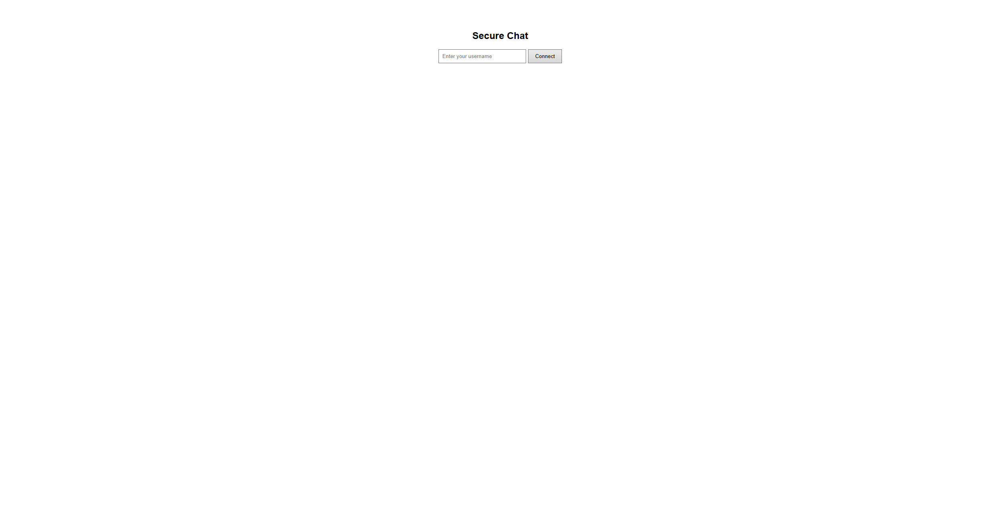
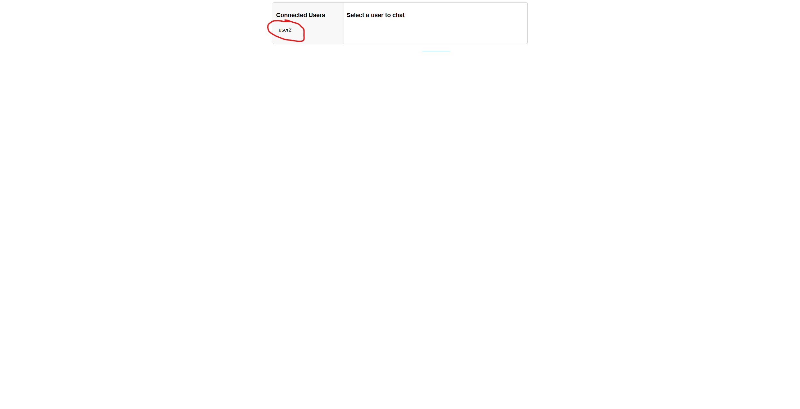
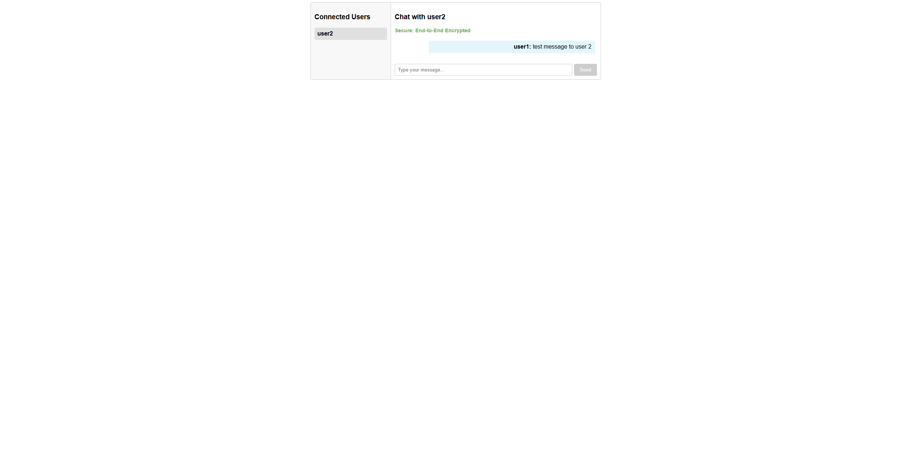
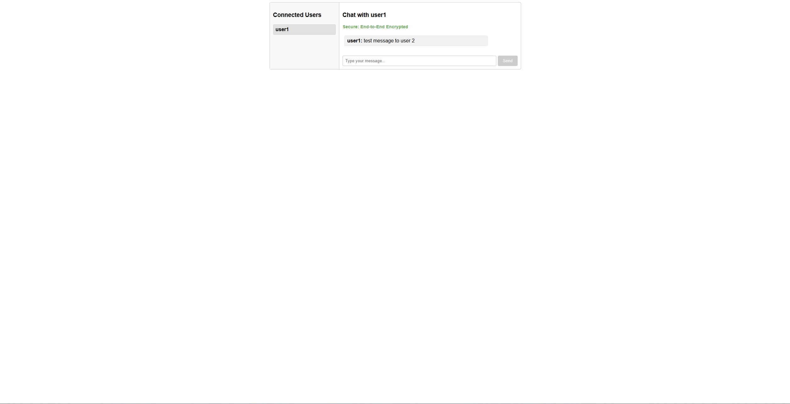

# SecureChatFrontend

This project was generated using [Angular CLI](https://github.com/angular/angular-cli) version 19.2.4.

## How to run frontend

1. Navigate to SecureChatFrontend folder "cd SecureChatFrontend".
2. Open terminal in the folder.
3. run command "npm install".
4. run command  "npx ng serve".
5. Or just simply open in Webstorm and run the project.

## How to run backend
1. Navigate to SecureChatAPI folder "cd SecureChatAPI".
2. Open terminal in the folder.
3. run command "dotnet restore".
4. run command  "dotnet run".
5. Or just simply open in Rider and run the project. 

## Cryptography
1. ECDH (P-256) is used for key exchange. [Generates a shared secret key between the sender and receiver]
2. AES-GCM (with random iv) is used for encryption and decryption. [Encrypts and decrypts messages]
3. MAC-SHA256 is used for message authentication. [Authenticates encrypted messages, ensuring they are not tampered with]
4. Ed25519 is used for digital signatures. [verify sender identity, preventing impersonation]

## How to use the application
1. login.

2. Choose a user to chat with.

3. Send a message. Both users need to click on each others names to start a chat. 

